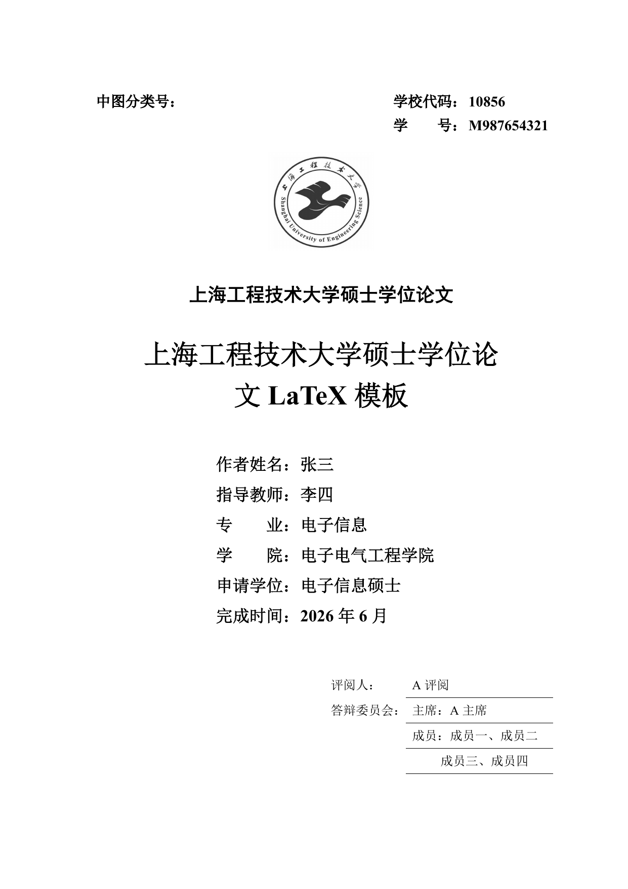
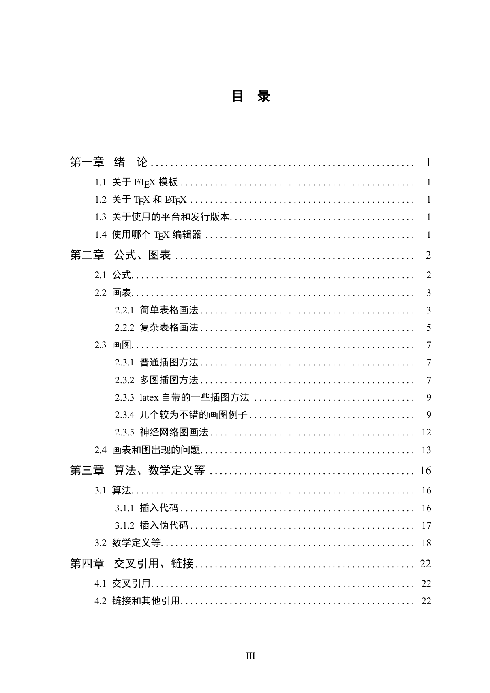
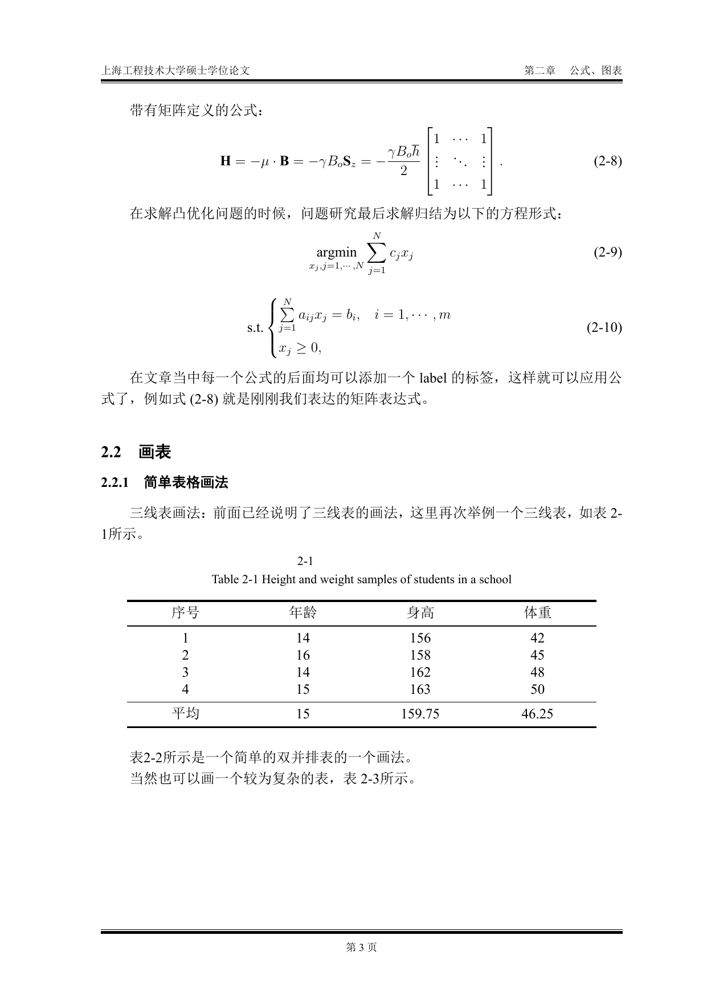
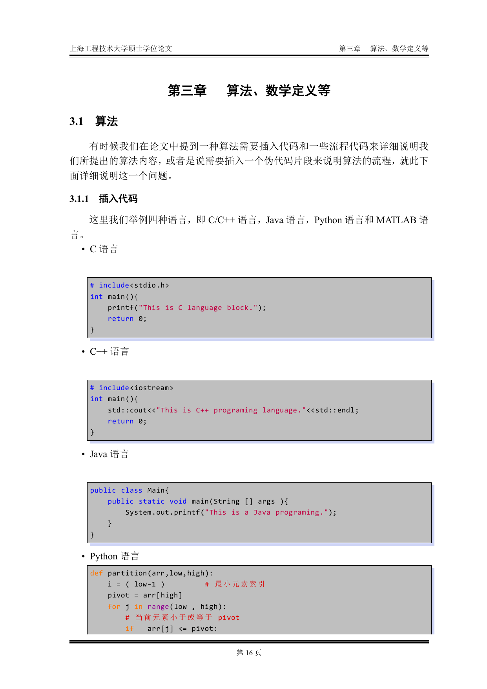

# 上海工程技术大学硕士学位论文 LaTeX 模板

按学校研究生处的 Word 论文格式要求整理的 LaTeX 模板。封面、页眉页脚、目录、三线表、公式编号、参考文献这些格式都已经按规范调好，写论文时专注内容即可。

模板只支持 **XeLaTeX** 引擎，源文件统一 **UTF-8** 编码，用 pdfLaTeX 等其它引擎编译不通过。

## 效果预览

| 中文封面 | 目录 |
| :---: | :---: |
|  |  |
| **公式与三线表** | **代码与算法** |
|  |  |

## 获取

```bash
git clone https://github.com/zhh2001/sues-thesis.git
```

## 环境依赖

### 字体

正文用的是 Windows 自带的中文字体，编译前请确认系统里装了以下几个，否则中文会显示成空白方块：

- 宋体 `SimSun`、黑体 `SimHei`：正文和标题
- `Consolas`：代码块
- `FontAwesome`：少量图标，TeX Live 一般自带

Windows 用户基本都有前三个。Linux / macOS 如果缺字体，把对应字体文件装进系统再 `fc-cache -f` 刷新缓存即可；也可以直接在 `suesthesis.cls` 里把字体名换成本机已有的，比如 macOS 的 `STSong`、`STHeiti`（文件里已经留好注释）。

### 发行版

装一个完整的 TeX 发行版就行，推荐 TeX Live，跨平台且更新及时。编辑器用 VSCode 配 LaTeX Workshop，或者 TeXstudio 都可以。

## 编译

### Linux / macOS

用 `Makefile`：

```bash
make            # 编译生成 paper.pdf
make wordcount  # 统计论文字数
make clean      # 清理编译中间文件
make cleanall   # 连同 paper.pdf 一起清理
```

### Windows

双击或在命令行运行 `Compile.bat`：

```bat
Compile.bat            :: 编译生成 paper.pdf
Compile.bat wordcount  :: 统计字数
Compile.bat clean      :: 清理中间文件
Compile.bat cleanall   :: 连同 paper.pdf 一起清理
```

## 目录结构

```text
paper.tex          主文件，按顺序 \input 各部分
suesthesis.cls     文档类：版式、字体、页眉页脚、定理与代码环境
suesthesis.cfg     封面信息变量、盲审开关、中英文摘要环境
covers/            中英文封面、原创性声明、授权书
chapters/          摘要、正文各章、参考文献、附录、致谢等
texfigs/           用 TikZ 绘制的示例插图
figures/           示例图片
bib/refers.bib     参考文献数据库
```

参考文献样式用的是 GB/T 7714-2015 数字顺序（`gbt7714-numeric`），由 TeX Live 自带的 `gbt7714` 宏包提供，仓库里不再单独存放 `.bst` 文件。需要换其它标准（如作者-年份）时，改 `chapters/ref.tex` 里的 `\bibliographystyle` 即可。

## 写作流程

1. 修改 `covers/pagetitle-chinese.tex` 和 `pagetitle-english.tex` 里的题目、姓名、导师、专业等信息；
2. 把 `chapters/` 下的示例内容替换成自己的论文；
3. 参考文献写进 `bib/refers.bib`；
4. 进入盲审时，把 `paper.tex` 里的 `\namesBlind{normal}` 改成 `\namesBlind{blind}`，作者、导师、学号等信息会自动隐去，致谢和科研成果两章也会自动跳过。

## 代码格式化（可选）

如果用 latexindent 格式化本模板，请带上仓库自带的 `.latexindent.yaml`，否则代码环境（`CLanguage`、`Python` 等）里的代码会被重新缩进、破坏原有排版：

```bash
latexindent -l .latexindent.yaml chapters/algorithms.tex
```

## 声明

本模板为学生个人整理，未经学校官方认证，仅供参考，因格式问题导致的后果请自行承担。提交前请务必对照当年研究生处发布的最新要求自查。

## 许可证与致谢

本模板基于 MobtgZhang 的开源模板改写，沿用 MIT 许可证，详见 [LICENSE](LICENSE)。
